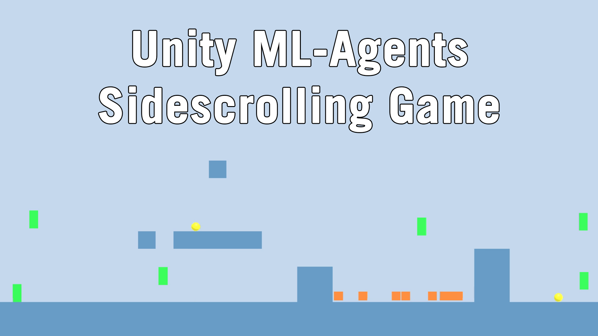

# Sidescrolling Agents
This repo contains a small Unity project that uses the Unity ML-Agents toolkit to train an agent to traverse through a sidescrolling game.

## Links

* [YouTube video showcasing the project](https://www.youtube.com/watch?v=elU-J99Hi8Y&feature=youtu.be)
* [Github repo for ML-Agents](https://github.com/Unity-Technologies/ml-agents)
* [Tutorial for setting up python environment on Windows](https://github.com/Unity-Technologies/ml-agents/blob/master/docs/Installation.md)
* [Tutorial for training agents in Unity](https://github.com/Unity-Technologies/ml-agents/blob/master/docs/Basic-Guide.md)

# Unity ML-Agents Toolkit (Beta)

**The Unity Machine Learning Agents Toolkit** (ML-Agents) is an open-source
Unity plugin that enables games and simulations to serve as environments for
training intelligent agents. Agents can be trained using reinforcement learning,
imitation learning, neuroevolution, or other machine learning methods through a
simple-to-use Python API. We also provide implementations (based on TensorFlow)
of state-of-the-art algorithms to enable game developers and hobbyists to easily
train intelligent agents for 2D, 3D and VR/AR games. These trained agents can be
used for multiple purposes, including controlling NPC behavior (in a variety of
settings such as multi-agent and adversarial), automated testing of game builds
and evaluating different game design decisions pre-release. The ML-Agents
toolkit is mutually beneficial for both game developers and AI researchers as it
provides a central platform where advances in AI can be evaluated on Unity’s
rich environments and then made accessible to the wider research and game
developer communities.

